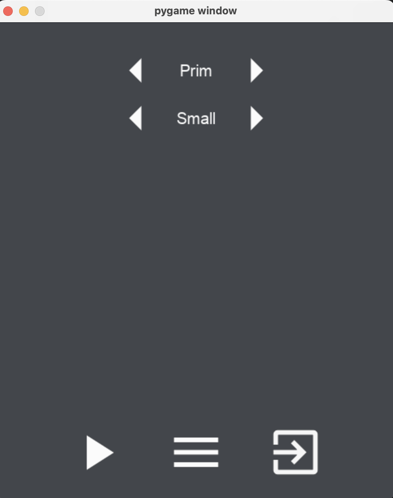
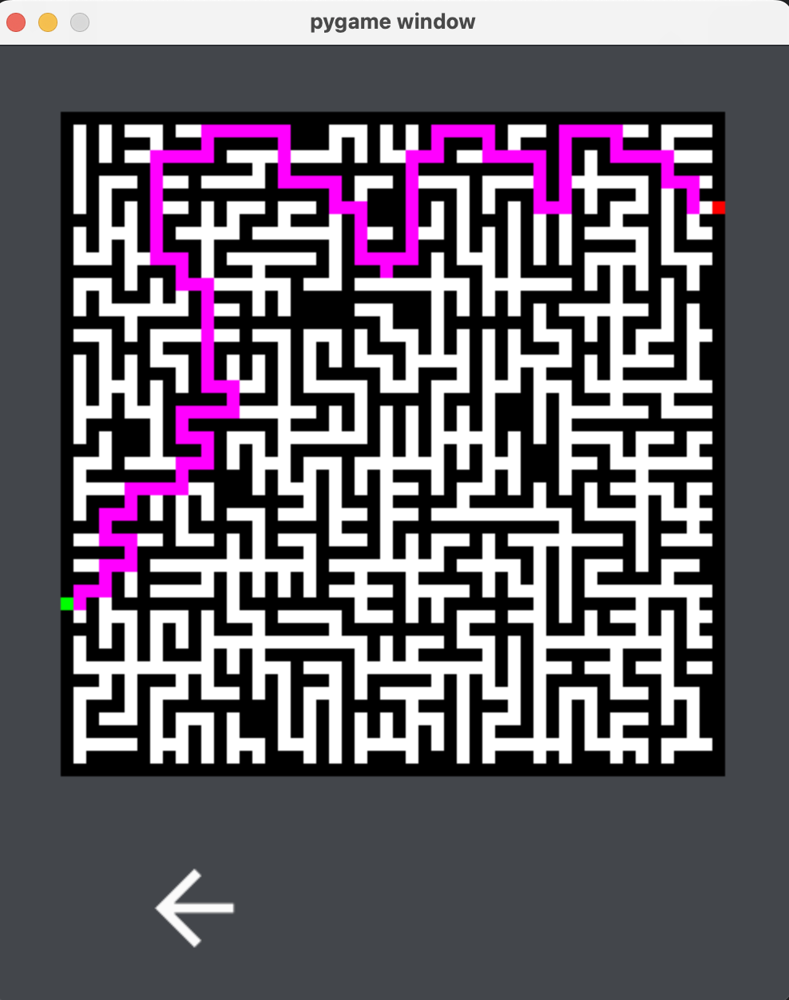

# Maze


https://user-images.githubusercontent.com/48132667/193464347-a795a755-4066-4862-8fbe-e66bfd5ca800.mp4


## Installation

```shell
git clone https://github.com/rpowel/maze
cd maze
pip install -r requirements.txt
cd app
python app.py
```

## Usage

### Gui Based

Running app.py (after installing requirements) will open a window where you can select
the size and type of maze you would like to use.




## Testing

```shell
# Install pytest
pip install pytest

pytest
```
